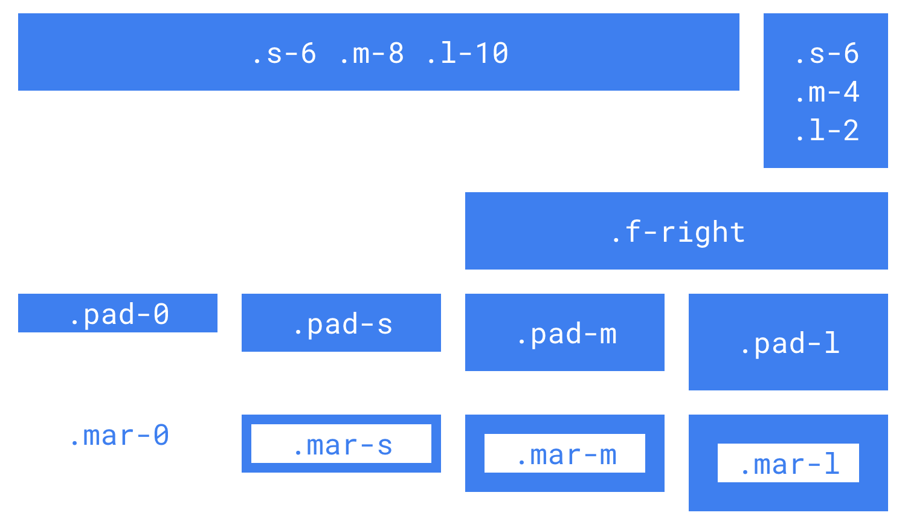

# Minimal-Grid
Simple grid for building column based responsive websites

Includes sass, css and minified css.

Examples at https://aadityataparia.github.io/minimal-grid.html

## How to use css (with default values)
- Simple grid is based on 12 column based design, i.e. \*-1 means 100/12% width, \*-2 means 100*2/12% and so on..
- To use grid, add `grid` class to parent element and s-\*, m-\* or l-\* classes to children elements.
- There are three types of grid classes
  - s (used on small devices with device width < 480px)
  - m (used on medium devices with device width < 960px and > 480px)
  - l (used on large devices with device width > 960px)
- mar-\* are margin classes and applies
  - mar-0: 0px margin
  - mar-s: small margin (8px)
  - mar-m: medium margin (16px)
  - mar-l: large margin (24px)
- pad-\* are padding classes and applies
  - pad-0: 0px padding
  - pad-s: small padding (8px)
  - pad-m: medium padding (16px)
  - pad-l: large padding (24px)
- b-1s is border class: applies `1px solid black` border
- hide-on-s class applies `display: none` when s classes are applied
- hide-on-m class applies `display: none` when m classes are applied
- hide-on-l class applies `display: none` when l classes are applied
- f-right class applies `float: right` on element
- f-left class applies `float: left` on element

## How to use sass

sass file is highly configurable, most of the things are based on variables

### Variables

| Variable  | Description | Default Value |
| ------------- | ------------- | ------------ |
| $small-break | Breakpoint for small classes (s-\*) | 480px |
| $medium-break | Breakpoint for medium classes (m-\*) | 960px |
| $border-color | Border color for b-1s class | black |
| $grid-size | Size of grid | 12 |
| $small-prefix | Prefix for small classes | s |
| $medium-prefix | Prefix for medium classes | m |
| $large-prefix | Prefix for large classes | l |
| $margin-prefix | Prefix for margin classes | mar |
| $padding-prefix | Prefix for padding classes | pad |
| $gaps | Map for margin and padding classes with suffix and values | (0: 0, s: 8px, m: 16px, l: 24px) |

